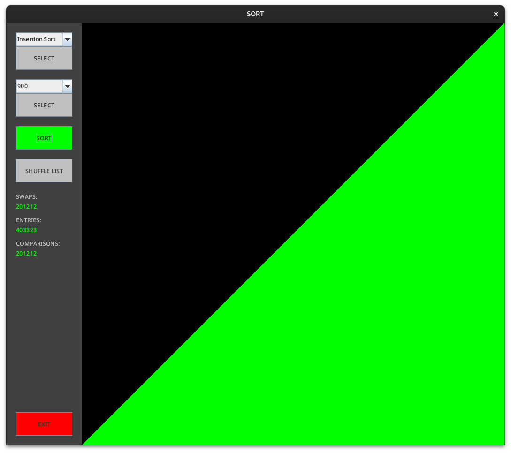
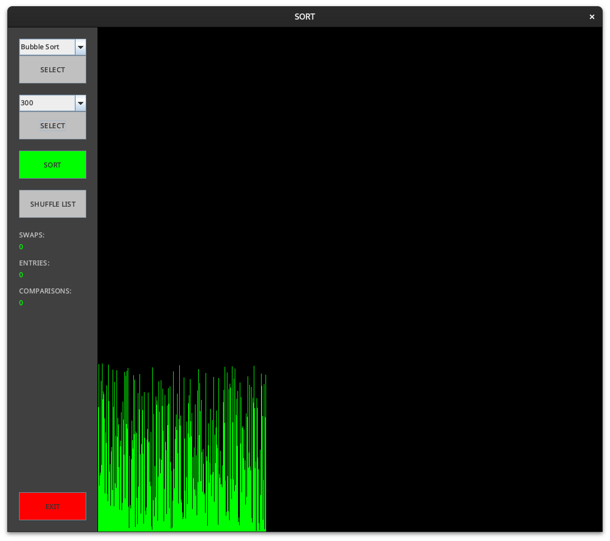
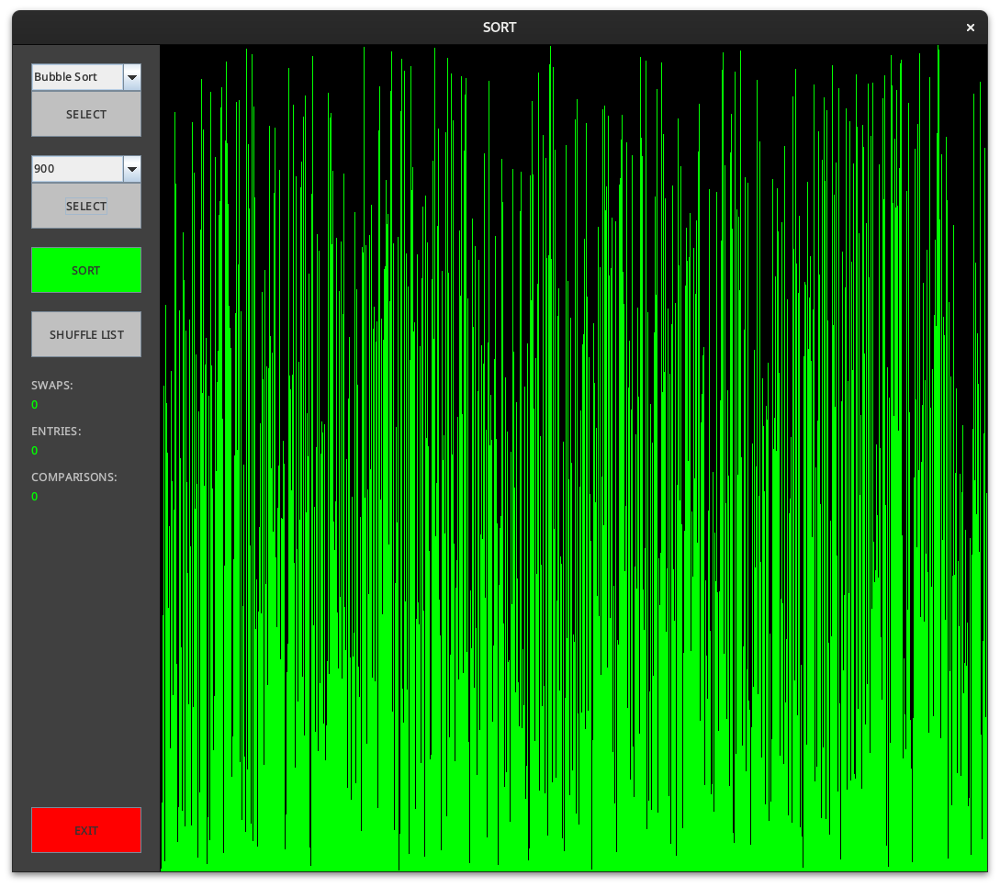
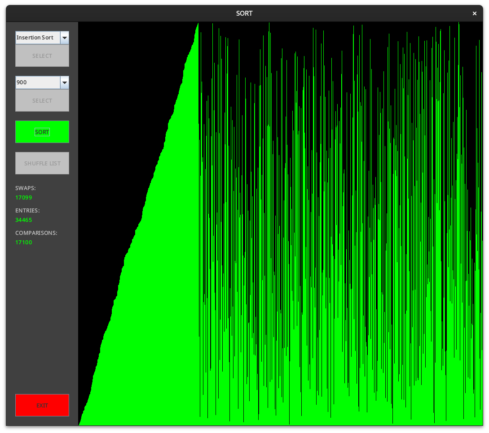
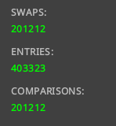

# Sorting Algorithm Visualizer (SAV)

## Table of Contents
1. [About](#about)
2. [Features](#features)
3. [Usage](#usage)
4. [Build Instructions](#build-instructions)

## About
A fun little side project i have been working on from time to time under the last month or so. I mainly made this application for fun and for greater understanding about sorting algorithms and their inner workings.

## Features
- Visualize popular sorting algorithms in real-time.
- Track metrics like swaps, comparisons, and list entries.
- Adjust list size up to a maximum of **900** elements.

## Usage
When you start SAV, you will see an interface like the image below:

- **Algorithm Selector**: Choose the sorting algorithm (e.g., **Bubble Sort**).
- **List Size Selector**: Select the size of the list to visualize (default is **300**).
- **Buttons**:
  - **SORT**: Sorts the list using the chosen algorithm.
  - **SHUFFLE LIST**: Randomizes the order of the list.
  - **EXIT**: Closes the application.

Below is an example of a maximum size (**900**) list being sorted:

You can also see the real-time progress of algorithms like **Insertion Sort**:

After sorting completes, the visual representation looks like this:

### Metrics Explained

- **SWAPS**: Number of times the list has been modified (`Collections.swap()` or `set()`).
- **ENTRIES**: Number of accesses to list elements (e.g., `get()`).
- **COMPARISONS**: Number of element comparisons (e.g., `list.get(i) > list.get(i + 1)`).

Note: These metrics give an indication of the algorithm's performance but may not be 100% accurate.
### Build instructions
1. **make build** to build the application
2. **make run** to start the application 
3. **make clean** to clean up the build directory (if desired)

## Requirements
- Java 11 or higher
- Gradle 6.0 or higher